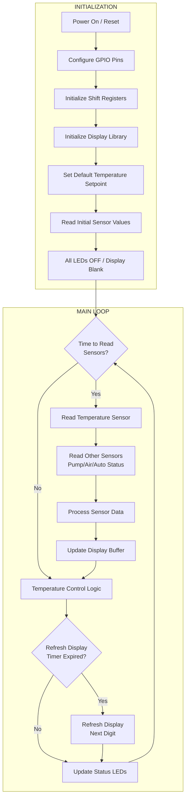
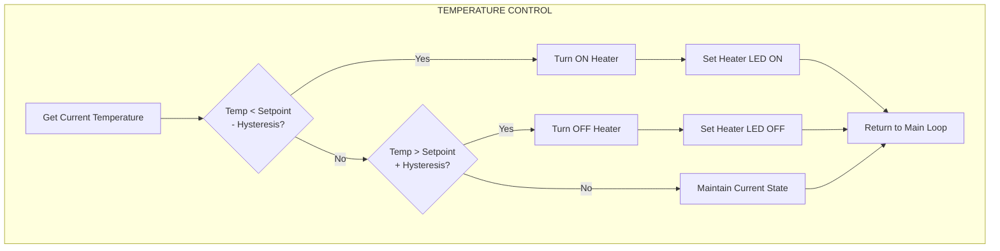
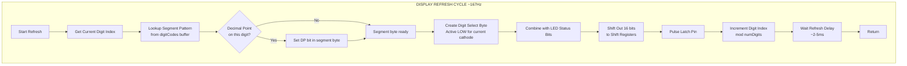
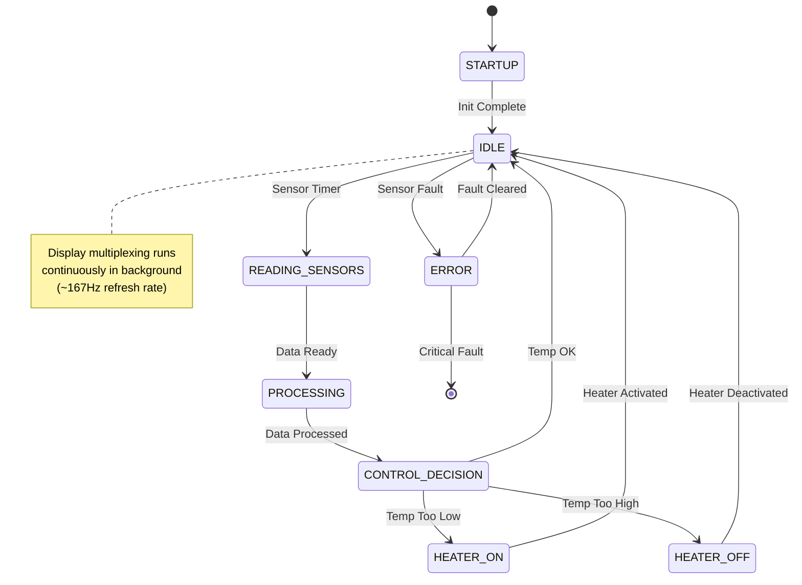
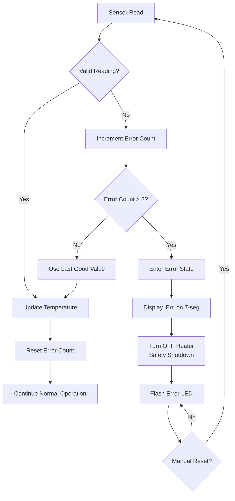

# Spa Control Software Flowchart

## System Overview

This flowchart describes how the firmware should work to control temperature and display sensor status on the 7-segment display.

---

## Main Control Flow



---

## Temperature Control Logic



---

## Display Multiplexing Cycle



---

## Sensor Reading Flow

```mermaid
flowchart TD
    subgraph SENSORS["SENSOR READING"]
        A[Sensor Read Timer Triggered] --> B[Select ADC Channel<br/>Temperature Sensor]
        B --> C[Start ADC Conversion]
        C --> D[Wait for Conversion Complete]
        D --> E[Read ADC Result]
        E --> F[Convert to Temperature<br/>ADC to Celsius]

        F --> G[Apply Calibration Offset]
        G --> H[Apply Smoothing Filter<br/>Moving Average]
        H --> I[Store in currentTemp Variable]

        I --> J[Read Digital Inputs<br/>Pump/Air/Auto Switches]
        J --> K[Update Status Flags]
        K --> L[Return to Main Loop]
    end
```



---

## Shift Register Communication

```mermaid
flowchart TD
    subgraph SHIFT["16-BIT SHIFT OUT PROTOCOL"]
        A[Start shiftOut16] --> B[Set Clock & Data HIGH<br/>Idle State]
        B --> C[Data goes LOW<br/>Start Signal]
        C --> D[Wait 16μs]
        D --> E[Clock goes LOW]
        E --> F[Wait 16μs]

        F --> G[Set byteIndex = 0]
        G --> H[Set bitIndex = 7<br/>MSB First]

        H --> I[Set Data Line<br/>to current bit value]
        I --> J[Wait 2μs<br/>Setup Time]
        J --> K[Clock HIGH<br/>Rising Edge Samples]
        K --> L[Wait 40μs]
        L --> M[Clock LOW]
        M --> N[Wait 20μs]

        N --> O{More bits<br/>in byte?}
        O -->|Yes| P[bitIndex--]
        P --> I

        O -->|No| Q{More bytes<br/>to send?}
        Q -->|Yes| R[byteIndex++<br/>bitIndex = 7]
        R --> I

        Q -->|No| S[Return Clock & Data<br/>to HIGH]
        S --> T[Wait 2μs]
        T --> U[Latch LOW<br/>40μs pulse]
        U --> V[Latch HIGH]
        V --> W[End]
    end
```



---

## Complete System State Machine



---

## Data Flow Diagram

```
┌─────────────────────────────────────────────────────────────────────────┐
│                           SENSOR INPUTS                                  │
├─────────────────────────────────────────────────────────────────────────┤
│  Temperature    Pump Switch    Air Switch    Auto Mode    Water Level   │
│  Sensor (ADC)   (Digital)      (Digital)     (Digital)    (Digital)     │
└───────┬─────────────┬──────────────┬────────────┬────────────┬──────────┘
        │             │              │            │            │
        ▼             ▼              ▼            ▼            ▼
┌─────────────────────────────────────────────────────────────────────────┐
│                        ATmega8A MICROCONTROLLER                          │
│  ┌──────────────────────────────────────────────────────────────────┐   │
│  │                      MAIN CONTROL LOOP                            │   │
│  │  ┌────────────┐   ┌────────────┐   ┌────────────┐                │   │
│  │  │  Sensor    │──▶│  Control   │──▶│  Display   │                │   │
│  │  │  Reading   │   │  Logic     │   │  Update    │                │   │
│  │  └────────────┘   └────────────┘   └────────────┘                │   │
│  │        │                │                │                        │   │
│  │        ▼                ▼                ▼                        │   │
│  │  ┌────────────┐   ┌────────────┐   ┌────────────┐                │   │
│  │  │ currentTemp│   │ heaterState│   │ digitCodes │                │   │
│  │  │ pumpStatus │   │ pumpState  │   │ ledStatus  │                │   │
│  │  │ airStatus  │   │ airState   │   │ dpPosition │                │   │
│  │  └────────────┘   └────────────┘   └────────────┘                │   │
│  └──────────────────────────────────────────────────────────────────┘   │
└───────────────────────────────┬─────────────────────────────────────────┘
                                │
                     ┌──────────┴──────────┐
                     │   GPIO OUTPUTS       │
                     │   PB3=DATA           │
                     │   PB5=CLOCK          │
                     │   PD5=LATCH          │
                     └──────────┬──────────┘
                                │
                                ▼
┌─────────────────────────────────────────────────────────────────────────┐
│                    SHIFT REGISTER CASCADE                                │
│  ┌─────────────────────────┐    ┌─────────────────────────┐             │
│  │   HEF4094B #1           │    │   HEF4094B #2           │             │
│  │   (Digit Select + LEDs) │───▶│   (Segment Control)     │             │
│  │                         │QS2 │                         │             │
│  │   Q0: Heater LED        │    │   Q0-Q7: Segments       │             │
│  │   Q1: Auto LED          │    │   a,b,c,d,e,f,g,dp      │             │
│  │   Q3: Air LED           │    │                         │             │
│  │   Q4: Pump LED          │    │                         │             │
│  │   Q5: Cathode 1 (D1)    │    │                         │             │
│  │   Q6: Cathode 3 (D3)    │    │                         │             │
│  │   Q7: Cathode 2 (D2)    │    │                         │             │
│  └─────────────────────────┘    └─────────────────────────┘             │
└───────────────────────────────────────┬─────────────────────────────────┘
                                        │
                                        ▼
┌─────────────────────────────────────────────────────────────────────────┐
│                           PHYSICAL OUTPUTS                               │
├─────────────────────────────────────────────────────────────────────────┤
│  7-Segment Display (3 digits)    Status LEDs    Heater Relay    Pump    │
│  Shows: Temperature / Error      Visual Status  On/Off Control  On/Off  │
└─────────────────────────────────────────────────────────────────────────┘
```

---

## Timing Diagram

```
Time ────────────────────────────────────────────────────────────────────▶

Sensor Read    ┌──┐                              ┌──┐
(every 500ms)  ┘  └──────────────────────────────┘  └────────────────────

Control Logic  ────┌──┐                              ┌──┐
(after read)       └──┘                              └──┘

Display Mux    ┌┐┌┐┌┐┌┐┌┐┌┐┌┐┌┐┌┐┌┐┌┐┌┐┌┐┌┐┌┐┌┐┌┐┌┐┌┐┌┐┌┐┌┐┌┐┌┐┌┐┌┐┌┐┌┐┌┐
(~167Hz)       ┘└┘└┘└┘└┘└┘└┘└┘└┘└┘└┘└┘└┘└┘└┘└┘└┘└┘└┘└┘└┘└┘└┘└┘└┘└┘└┘└┘└┘└

Digit 1        ██    ██    ██    ██    ██    ██    ██    ██    ██    ██
Digit 2          ██    ██    ██    ██    ██    ██    ██    ██    ██    ██
Digit 3            ██    ██    ██    ██    ██    ██    ██    ██    ██    ██

               ◀──────── 15ms cycle (3 digits × 5ms each) ────────▶
```

---

## Error Handling Flow



---

## Summary

The software operates in a continuous loop with three main responsibilities:

1. **Sensor Reading** (~2Hz): Read temperature and status inputs
2. **Control Logic**: Compare temperature to setpoint, control heater with hysteresis
3. **Display Multiplexing** (~167Hz): Rapidly cycle through digits to maintain display

The shift register cascade allows control of both the 3-digit display and 4 status LEDs using only 3 GPIO pins from the microcontroller.
