# Spa Control Firmware Flowchart

Generated from `spa_control.ino`

---

## System Overview

```
┌─────────────────────────────────────────────────────────────────────────┐
│                         SPA CONTROL SYSTEM                               │
│                                                                          │
│  ┌──────────┐    ┌──────────┐    ┌──────────┐    ┌──────────┐          │
│  │ Temp     │    │ Control  │    │ Display  │    │ Relay    │          │
│  │ Sensor   │───▶│ Logic    │───▶│ Update   │───▶│ Outputs  │          │
│  │ (ADC)    │    │          │    │          │    │          │          │
│  └──────────┘    └──────────┘    └──────────┘    └──────────┘          │
│       │                                                │                │
│       ▼                                                ▼                │
│  ┌──────────┐                                    ┌──────────┐          │
│  │ Switch   │                                    │ Status   │          │
│  │ Inputs   │                                    │ LEDs     │          │
│  └──────────┘                                    └──────────┘          │
└─────────────────────────────────────────────────────────────────────────┘
```

---

## 1. Initialization Flow (setup → initializeSystem)

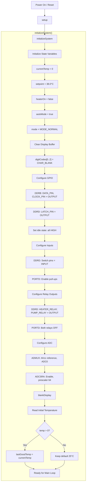

---

## 2. Main Loop (loop)

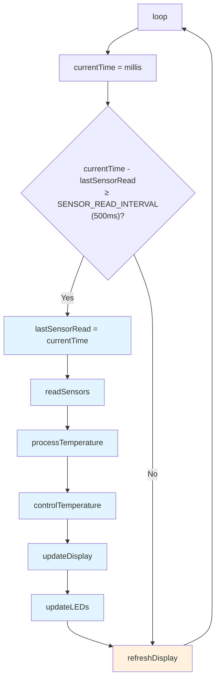

---

## 3. Sensor Reading (readSensors)

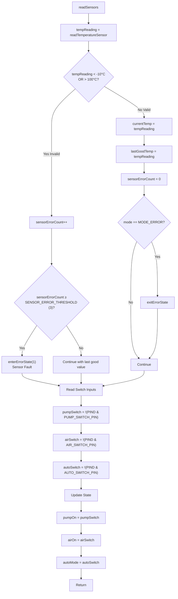

---

## 4. Temperature Sensor Reading (readTemperatureSensor)

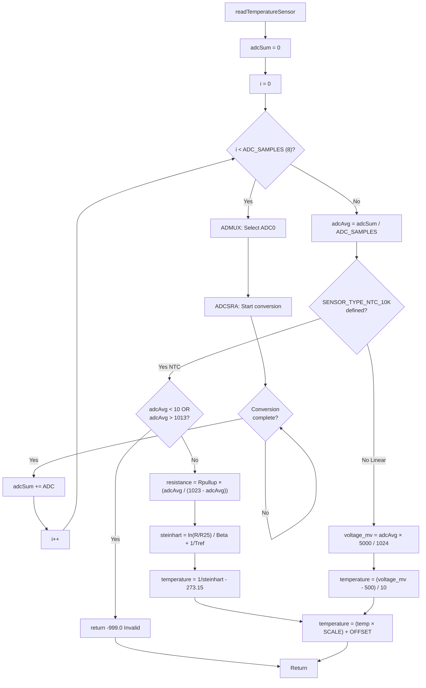

---

## 5. Temperature Processing (processTemperature)

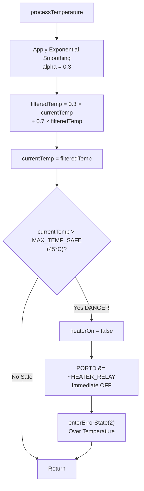

---

## 6. Temperature Control (controlTemperature)

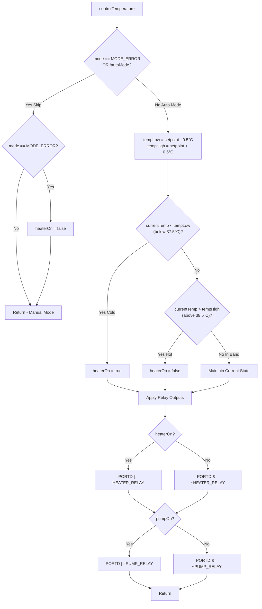

---

## 7. Display Update (updateDisplay)

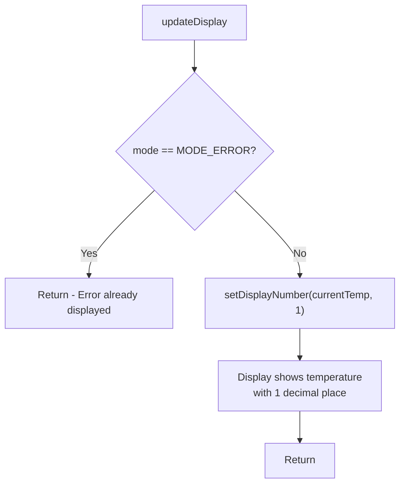

---

## 8. Display Refresh Cycle (refreshDisplay)

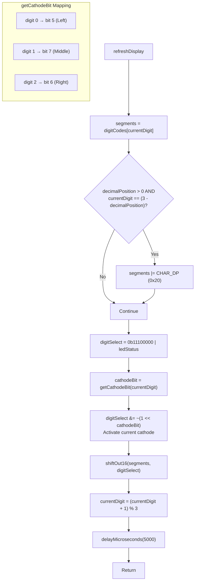

---

## 9. Shift Register Protocol (shiftOut16)

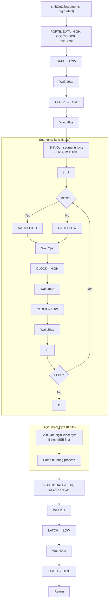

---

## 10. LED Update (updateLEDs)

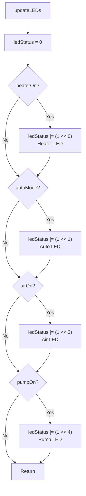

---

## 11. Error Handling

```mermaid
flowchart TD
    subgraph ENTER["enterErrorState(errorCode)"]
        A[enterErrorState] --> B[mode = MODE_ERROR]
        B --> C[heaterOn = false]
        C --> D["PORTD &= ~HEATER_RELAY<br/>Safety Shutdown"]
        D --> E["setDisplayError(errorCode)"]
        E --> F["Display shows 'Er1' or 'Er2'"]
        F --> G["ledStatus |= HEATER_LED<br/>Flash indicator"]
    end

    subgraph EXIT["exitErrorState()"]
        H[exitErrorState] --> I[mode = MODE_NORMAL]
        I --> J[sensorErrorCount = 0]
    end

    subgraph DISPLAY["setDisplayError(code)"]
        K[setDisplayError] --> L["digitCodes[0] = 'E'"]
        L --> M["digitCodes[1] = 'r'"]
        M --> N["digitCodes[2] = code digit"]
        N --> O[decimalPosition = 0]
    end
```

---

## State Machine Overview

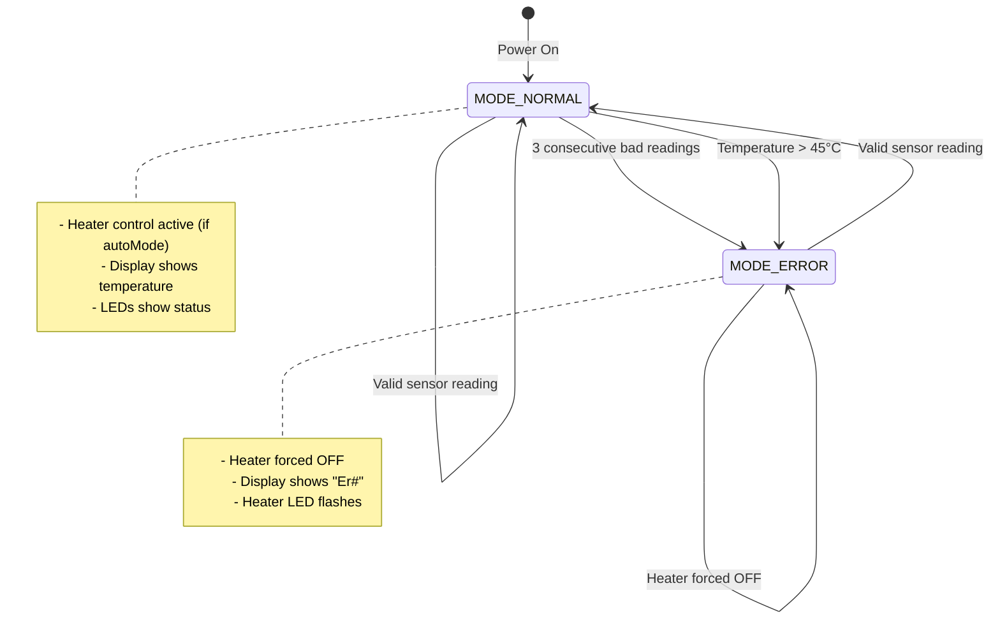

---

## Timing Diagram

```
Time ─────────────────────────────────────────────────────────────────────▶

Sensor Read     ┌──┐                                    ┌──┐
(every 500ms)   ┘  └────────────────────────────────────┘  └──────────────

Control Logic   ────┌──┐                                    ┌──┐
(after sensor)      └──┘                                    └──┘

Display Mux     ┌┐┌┐┌┐┌┐┌┐┌┐┌┐┌┐┌┐┌┐┌┐┌┐┌┐┌┐┌┐┌┐┌┐┌┐┌┐┌┐┌┐┌┐┌┐┌┐┌┐┌┐┌┐┌┐┌┐
(continuous)    ┘└┘└┘└┘└┘└┘└┘└┘└┘└┘└┘└┘└┘└┘└┘└┘└┘└┘└┘└┘└┘└┘└┘└┘└┘└┘└┘└┘└┘└

                ◀──── 5ms ────▶
                    per digit

Digit 0 (Left)  ██      ██      ██      ██      ██      ██      ██
Digit 1 (Mid)     ██      ██      ██      ██      ██      ██      ██
Digit 2 (Right)     ██      ██      ██      ██      ██      ██      ██

                ◀──────── 15ms full cycle ────────▶
                        (~67Hz refresh rate)
```

---

## Data Flow Summary

```
┌─────────────────────────────────────────────────────────────────────────┐
│                              INPUTS                                      │
├─────────────┬─────────────┬─────────────┬─────────────┬─────────────────┤
│ Temp Sensor │ Pump Switch │ Air Switch  │ Auto Switch │                 │
│    (ADC0)   │   (PD2)     │   (PD3)     │   (PD4)     │                 │
└──────┬──────┴──────┬──────┴──────┬──────┴──────┬──────┴─────────────────┘
       │             │             │             │
       ▼             ▼             ▼             ▼
┌─────────────────────────────────────────────────────────────────────────┐
│                         STATE STRUCTURE                                  │
│  ┌─────────────┐  ┌─────────────┐  ┌─────────────┐  ┌─────────────┐     │
│  │ currentTemp │  │ pumpOn      │  │ airOn       │  │ autoMode    │     │
│  │ setpoint    │  │ heaterOn    │  │ mode        │  │ ledStatus   │     │
│  │ lastGoodTemp│  │ digitCodes[]│  │ errorCount  │  │             │     │
│  └─────────────┘  └─────────────┘  └─────────────┘  └─────────────┘     │
└───────────────────────────────┬─────────────────────────────────────────┘
                                │
       ┌────────────────────────┼────────────────────────┐
       ▼                        ▼                        ▼
┌─────────────────┐  ┌─────────────────────┐  ┌─────────────────┐
│  HEATER RELAY   │  │   7-SEGMENT DISPLAY │  │   STATUS LEDs   │
│     (PD6)       │  │  (Shift Registers)  │  │ (Shift Regs)    │
│                 │  │                     │  │                 │
│  ON: temp < 37.5│  │  Normal: "38.5"     │  │ Bit 0: Heater   │
│  OFF: temp > 38.5│ │  Error:  "Er1"      │  │ Bit 1: Auto     │
└─────────────────┘  └─────────────────────┘  │ Bit 3: Air      │
                                              │ Bit 4: Pump     │
┌─────────────────┐                           └─────────────────┘
│   PUMP RELAY    │
│     (PD7)       │
│                 │
│  Follows switch │
└─────────────────┘
```

---

## Error Codes

| Code | Display | Meaning | Trigger |
|------|---------|---------|---------|
| 1 | Er1 | Sensor Fault | 3 consecutive readings outside -10°C to 100°C |
| 2 | Er2 | Over Temperature | Temperature exceeds 45°C |
